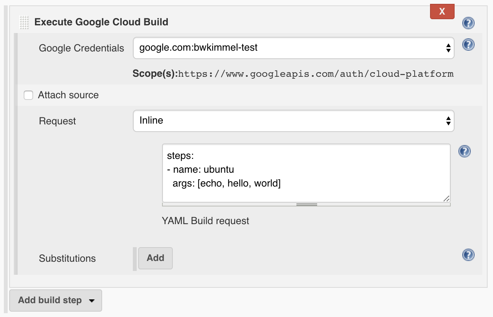
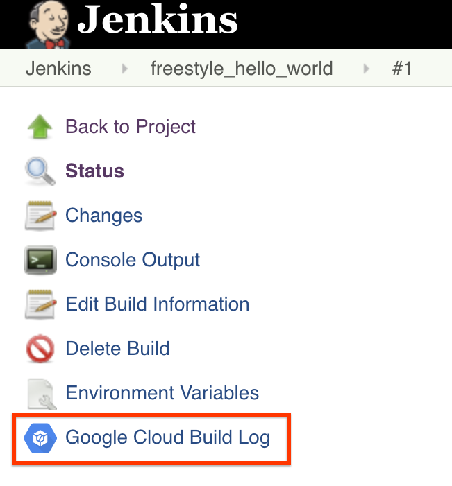
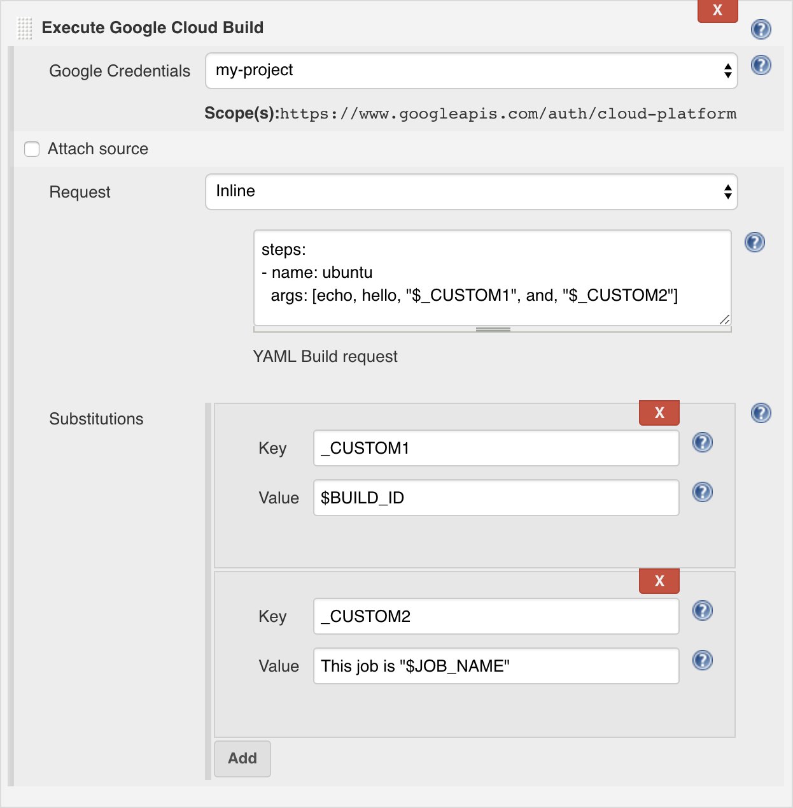
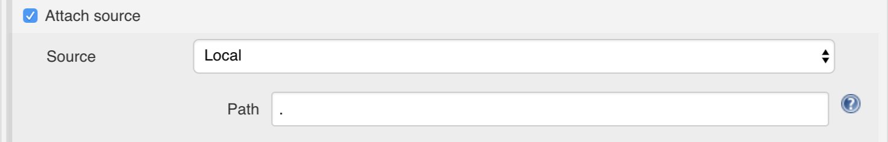
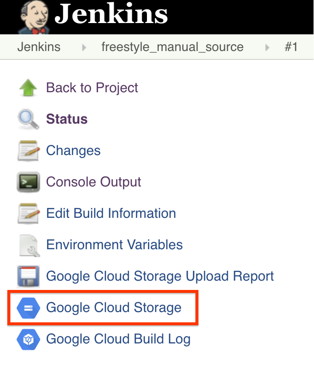
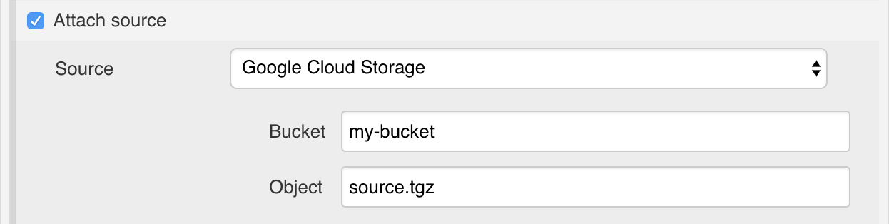
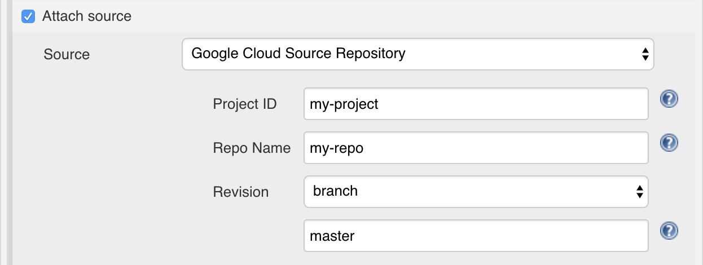
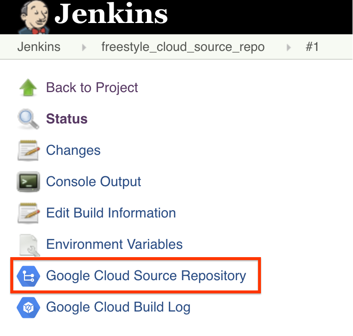

Jenkins Google Cloud Build Plugin
=================================

<!-- TODO: Add build status badge and link to Jenkins plugin page. -->

[Google Cloud Container Builder](https://cloud.google.com/container-builder)
enables you to build container images and other artifacts from application
source code. You can configure builds to fetch dependencies, run unit tests,
static analyses, and integration tests, and create artifacts with build tools
like docker, gradle, maven, bazel, and gulp. Builds run on Google-hosted
infrastructure with 120 free build minutes a day and up to 10 concurrent builds.

This Jenkins plugin allows you to call Container Builder as a build step.


# Prerequisites


*   In order to run the Google Cloud Container Builder, you must set up a Google
    Cloud account and [enable the API](https://cloud.google.com/container-builder/docs/quickstarts/curl).
*   You must have a [Jenkins instance set up and running](https://jenkins.io/doc/book/getting-started/).
*   The Container Builder plugin uses
    [google-oauth-plugin](https://wiki.jenkins.io/display/JENKINS/Google+OAuth+Plugin)
to allow the user to specify credentials for connecting to the cloud instance.
You will need to create a Service Account key in the Google Cloud project, then
in Jenkins select Google Service Account from private key and upload the private
key. See the [google oauth plugin instructions](https://wiki.jenkins.io/display/JENKINS/Google+OAuth+Plugin)
for more details and links.
*   Some of the examples below use the
    [google-storage-plugin](https://wiki.jenkins.io/display/JENKINS/Google+Cloud+Storage+Plugin)
to upload and download files from Google Cloud Storage.  Please refer to the
[google-storage-plugin instructions](https://wiki.jenkins.io/display/JENKINS/Google+Cloud+Storage+Plugin)
for more details on its usage.


# Hello world

The Google Container Builder Plugin takes a build request in JSON or YAML, in
the same format as is accepted by the [container builder through curl](https://cloud.google.com/container-builder/docs/quickstarts/curl)
or [through gcloud](https://cloud.google.com/container-builder/docs/quickstarts/gcloud),
and sends it to the cloud. See Writing [Custom Build Requests](https://cloud.google.com/container-builder/docs/how-to/writing-build-requests)
for more information on composing the build request.

The Build step requires selecting the credentials that were configured above,
and the Build Request. The build request may be specified inline (as
demonstrated below), or from a file located in the Jenkins workspace.

After the command is sent, the plugin polls the Container Builder to check the
status. If the step fails, the Jenkins step is failed. If it succeeds, the
Jenkins step succeeds.





In this example, the build request runs a simple step: in the Ubuntu docker
image, which is available by default, it runs the command "echo hello world".

Once the build has started, a link to the build log in Google Cloud Console will
be appear in the side panel under the Jenkins build.





# Custom substitutions

The input for this plugin is compatible with the YAML files you would use with
curl or gcloud. To maintain this compatibility, we do not perform any Jenkins
substitutions on the build request. For example, if the build request contains
the string "$BUILD_ID", it will be passed as-is to Container Builder, which will
interpret it as a [built-in substitution](https://cloud.google.com/container-builder/docs/concepts/build-requests#built-in_substitutions)
(in this case, $BUILD_ID will be replaced by Container Builder's build ID).

To allow customization using Jenkins variables, the plugin allows adding
user-defined substitutions, in [the same format as in the build
request](https://cloud.google.com/container-builder/docs/concepts/build-requests#user-defined_substitutions).
The value of the custom substitutions is interpreted using the standard Jenkins
rules. The example below shows how Jenkins variables can be used in a build
request:





The "Key" fields are subject to the same constraints as the
[user-defined substitutions](https://cloud.google.com/container-builder/docs/concepts/build-requests#user-defined_substitutions)
in Container Builder. The "Value" fields for _CUSTOM1 and _CUSTOM2 are
interpreted through Jenkins at runtime, and the bindings are passed to Container
Builder.


# Attaching Source Code
To attach source code to your Google Cloud Container Builder build request,
check the "Attach source" box, select the type of source you wish to attach, and
complete the associated fields. You may attach source code from the local
workspace, from Google Cloud Storage, or from a Google Cloud Source Repository.


## Local

This option is useful, for example, if you use another Jenkins plugin to
download source code into your local workspace. Specify the path to the
directory within the Jenkins workspace whose contents you wish to attach. This
directory will be archived and uploaded to a temporary bucket in Google Cloud
Storage.





Once the build starts, a link to the Google Cloud Storage bucket (in Cloud
Console) will appear in the side panel for the Jenkins build.





## Google Cloud Storage

If you already have an archive of your source stored in Google Cloud Storage
(for example, an archive uploaded in a previous step using the
[google-storage-plugin](https://wiki.jenkins.io/display/JENKINS/Google+Cloud+Storage+Plugin)),
provide the bucket name and the path within the bucket to the archive.





Once the build starts, a link to the Google Cloud Storage bucket (in Cloud
Console) will appear in the side panel for the Jenkins build.


## Google Cloud Source Repository

If your code is hosted in a Google Cloud Source Repository, specify the project
ID (if different from the project associated with your credentials), repository
name (if other than "default"), and the branch, tag, or commit from which you
wish to build.





To attach a source repository from a project other than the project associated
with your credentials, the requestor's service account as a [member with read
access](https://cloud.google.com/source-repositories/docs/setting-up-repositories)
to the source repository. To obtain the service account email, either look up
the Container Builder service account, or simply try this step without
permissions and get the email from the error message.

Once the build starts, a link to the Google Cloud Source Repository (in Cloud
Platform Console) will appear in the side panel for the Jenkins build.





# Pipeline as Code

[Jenkins Pipeline](https://jenkins.io/solutions/pipeline/) allows for the
build/test/deploy pipeline to be specified in the form of
[Groovy](http://groovy-lang.org/) code, which may be stored in a file
(`Jenkinsfile`) included alongside the rest of the source code under version
control. The Container Builder may also be invoked from a pipeline. For example:


```groovy
node {
    stage('Build') {
        def message = 'Hello, World!'

        googleCloudBuild \
            credentialsId: 'my-project',
            source: local('src'),
            request: file('cloudbuild.yaml'),
            substitutions: [
                _CUSTOM1: message,
                _CUSTOM2: "Lorem ipsum, dolor sit amet."
            ]
    }
}
```


This example archives the contents of the `src` directory and uploads the
resulting tgz-file to Cloud Storage. The build request stored in
`cloudbuild.yaml` is then sent to Container Builder using the credentials for
the `my-project` and with the custom variables `_CUSTOM1` and `_CUSTOM2`
attached to the request.

The `googleCloudBuild` function accepts the following parameters:

*   `credentialsId` (required) - the string identifying which credentials (provided by the Google OAuth plugin) to send in the request
*   `request` (required) - the build request to send to Container Builder. This must be one of the following:
    *   `file(FILENAME)` - sends the contents of `FILENAME` as the build request
    *   `inline(REQUEST)` - sends `REQUEST` (a YAML or JSON string) as the build request
*   `source` (optional) - the source to attach to the build request. If provided, this must be one of the following:
    *   `local(PATH)` - archives the contents of `PATH`, uploads the resulting tgz to Cloud Storage and uses that as the source in the build request
    *   `storage(bucket: BUCKET, object: OBJECT)` - uses an existing Cloud Storage object as the source in the build request
    *   `repo(projectId: PROJECT_ID, repoName: REPO_NAME, branch: BRANCH, tag: TAG, commit: COMMIT)` - uses a Cloud Source Repository as the source in the build request. Exactly one of branch, tag, or commit must be specified. The projectId and repoName parameters may be omitted, in which case the same semantics are used as [described in the API documentation](https://cloud.google.com/container-builder/docs/api/reference/rest/v1/RepoSource).
*   `substitutions` (optional) - a map indicating the custom substitutions to include in the requesti


# Development

## How to build

    mvn clean package

Creates the plugin HPI package for use with Jenkins.


## License

    Copyright 2017 Google Inc.

    Licensed under the Apache License, Version 2.0 (the "License");
    you may not use this file except in compliance with the License.
    You may obtain a copy of the License at

        https://www.apache.org/licenses/LICENSE-2.0

    Unless required by applicable law or agreed to in writing, software
    distributed under the License is distributed on an "AS IS" BASIS,
    WITHOUT WARRANTIES OR CONDITIONS OF ANY KIND, either express or implied.
    See the License for the specific language governing permissions and
    limitations under the License.
